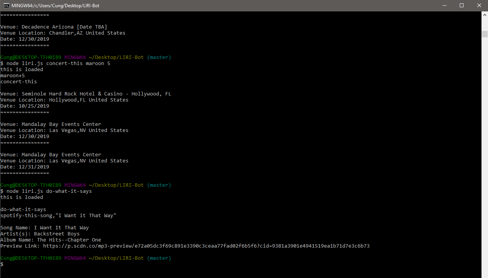

# LIRI-Bot

LIRI is a command line node app that takes in parameters and gives you back data based off the following parameters: 
    
```concert-this```
```spotify-this-song```
```movie-this```
```do-what-it-says```
    
These paramaters will display information on the command terminal based on what you want to search. 

# How to Run LIRI-Bot

* node liri.js concert-this/spotify-this-song/movie-this/do-what-it-says ```<search parameter here>```

# concert-this: 

-	Name of the venue
-	Venue location
-	Date of the Event (use moment to format this as "MM/DD/YYYY")



# spotify-this-song: 

-	Artist(s)
-	The song's name
-	A preview link of the song from Spotify
-	The album that the song is from

# movie-this: 

-	Title of the movie.
-	Year the movie came out.
-	IMDB Rating of the movie.
-	Rotten Tomatoes Rating of the movie.
-	Country where the movie was produced.
-	Language of the movie.
-	Plot of the movie.
-	Actors in the movie.

# do-what-it-says: 

LIRI will use the text from “random.txt” and call on of LIRI’s commands. 
It should run Spotify-this-song for “I want it That way”. 

# Technologies used:

* Spotify API
* OMDB API
* Bands In Town API
* Node.js
* Javascript
* NPM packages

# Created by Cuong Nguyen 